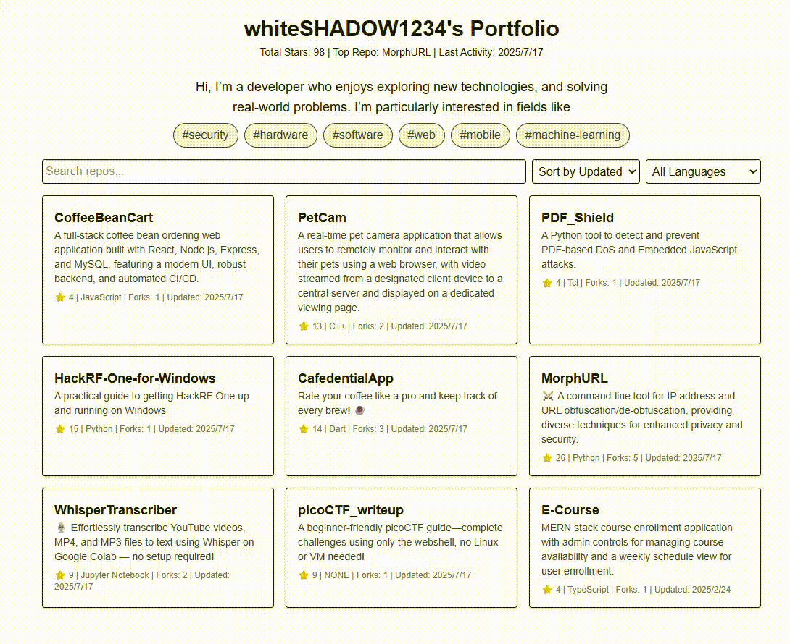

# GitHub Portfolio
<p align="center">
  
  
  
  
  
  
</p>

**GitHub‑Portfolio** is a static Next.js site that automatically pulls in your public GitHub repos and showcases them—alongside a personalized intro—via **interactive, clickable tags** like `security`, `software`, `hardware`, and `machine-learning`. Unlike typical portfolio templates, it combines **hands-free GitHub automation**, **developer-defined** topical interests, and dynamic filtering to create a personalized, always-updated showcase. Just fork, customize your tags and intro, and deploy instantly with GitHub Pages—all without a backend.

> [!NOTE]
> **This project is intentionally simple and beginner-friendly.** Feel free to tweak the UI, refactor components, change layout behavior, or even replace the entire filtering logic—this is just a basic starter to get you up and running quickly. Your creativity is welcome!

## Table of Contents
- [Demo](#demo)
- [Features](#features)
- [Setup & Usage](#setup--usage)
- [Contributing](#contributing)


## Demo


**Live Site:** https://whiteshadow1234.github.io/GitHub-Portfolio/

## Features

- **Automated Updates**: Fetches repository data every 6 hours
- **Self‑Intro Section**: Brief developer introduction with following tag section
- **Tag Filters**: Filter projects by self-defined tags like **security**, **software**, **hardware**, **machine‑learning** 
- **Search & Filter**: Find repositories by name, description, or language
- **Analytics**: View total stars, forks, and activity insights
- **Responsive Design**: Works on desktop, tablet, and mobile
- **Easy Setup**: One-click deployment with GitHub Actions

### Main File structure
```bash
github-portfolio/
├── .github/workflows/nextjs.yml     # CI/CD workflow
├── app/
│   ├── components/                 # React components
│   │   └── RepoCard.js             # Individual repo card
│   └── pages.js                    # Next.js pages
├── public/                         # Static files
│   └── repos.json                  # Repositories' data
├── scripts/                        # Build scripts
│   └── fetch-repos.js              # Repository fetching
├── styles/                         # Global styles
│   └── globals.css                 # Tailwind CSS
├── .env                            # Environment template
├── .gitignore                      # Git ignore rules
├── package.json                    # Dependencies and scripts
└── README.md                       # Documentation
```


## Setup & Usage

1. Fork this repository
    Click the `Fork` button in the top right corner of this repository.
2. Clone the repository
    ```bash
    git clone https://github.com/whiteSHADOW1234/github-portfolio.git
    cd github-portfolio
    ```
3. Install dependencies
    ```bash
    npm install
    ```
4. Create environment file
    Create a `.env` file right under the root directory and fill in the data:
    ```bash
    GH_USERNAME=YOUR_USERNAME
    GH_TOKEN=YOUR_GITHUB_TOKEN
    ```
5. Define the repositories you want to show on the portfolio in `scripts/fetch-repos.mjs`
    ```javascript
    const includedRepoNames  = [
    'YOUR_REPO_NAME_1',
    'YOUR_REPO_NAME_2',
    ...
    ]
    ```
6. Complete the **Self-Intro** section in `app/pages.js`
    ```javascript
        {/* Self introduction section */}
        <section className="mb-2 text-center mx-auto max-w-xl">
            <p className="text-lg">
            Hi, I&rsquo;m a developer who enjoys exploring new technologies, and solving real-world problems.
            I&rsquo;m particularly interested in fields like{' '}
            </p>
        </section>
    ```
7. Define the **Tag section** in `app/pages.js`
    ```javascript
    const availableTags  = [
        'security',
        'hardware',
        'software',
        'web',
        'mobile',
        'machine-learning',
        ...
    ];
    ```
    
> [!NOTE]
> To fully use the **tag filtering** feature, make sure you’ve added the matching topic tags (e.g., `security`, `hardware`, `software`, `machine-learning`) in the **"Topics"** section of each GitHub repository — visit your repo page → **About → Topics** to add them.  

8. Deploy GitHub Pages

    Push the updated code to the `main` branch to trigger the GitHub Actions' deployment workflow.

### Development Commands
```bash
# Start development server
npm run dev

# Fetch latest repositories
npm run fetch

# Build for production
npm run build

# Preview production build
npm run build && npm run start
```
### GitHub Token (Optional but Recommended)
For higher API rate limits, create a GitHub Personal Access Token:

1. Go to GitHub Settings → Developer settings → Personal access tokens → Tokens (classic)
2. Generate new token (classic)
3. Select scopes: public_repo (for public repos only)
4. Copy the token

#### For GitHub Actions:

- The `GITHUB_TOKEN` is automatically available
- No additional setup required

#### For local development:

- Add token to `.env.local` or `.env` file
- Provides 5000 requests/hour vs 60 without token

### CI/CD Workflow
The GitHub Actions workflow (`.github/workflows/nextjs.yml`):

- **Triggers:** Push to main, every 6 hours, manual dispatch
- **Steps:**
    1. Checkout code
    2. Setup Node.js
    3. Install dependencies
    4. Fetch latest repositories
    5. Build Next.js app
    6. Deploy to GitHub Pages

## Contributing

1. Fork the repository
2. Create feature branch: `git checkout -b feature/amazing-feature`
3. Commit changes: `git commit -m 'Add amazing feature'`
4. Push branch: `git push origin feature/amazing-feature`
5. Open Pull Request


