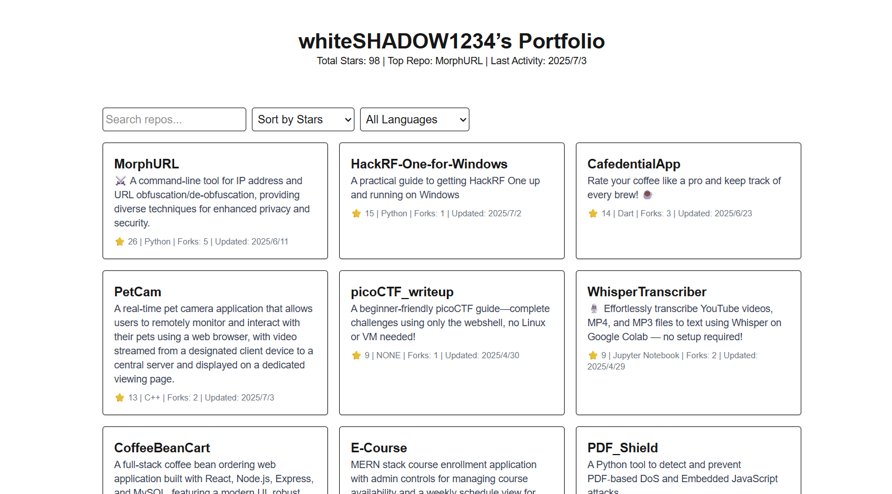

# GitHub Portfolio
<p align="center">
  
  
  
  
  
  
</p>
Automated GitHub portfolio showcase with CI/CD deployment to GitHub Pages.

## Table of Contents
- [Demo](#demo)
- [Features](#features)
- [Setup & Usage](#setup-usage)
- [Contributing](#contributing)


## Demo


**Link:** https://whiteshadow1234.github.io/GitHub-Portfolio/
## Features

- 🚀 **Automated Updates**: Fetches repository data every 6 hours
- 🔍 **Search & Filter**: Find repositories by name, description, or language
- 📊 **Analytics**: View total stars, forks, and activity insights
- 📱 **Responsive Design**: Works on desktop, tablet, and mobile
- 🔗 **Embed Widget**: Share repository cards on other websites
- ⚡ **Fast Loading**: Static generation with Next.js
- 🔧 **Easy Setup**: One-click deployment with GitHub Actions

### Main File structure
```bash
github-portfolio/
├── .github/workflows/nextjs.yml     # CI/CD workflow
├── app/
│   ├── api/
│   │   └── repos.js                 # API endpoint
│   ├── components/                 # React components
│   │   └── RepoCard.js             # Individual repo card
│   └── pages.js                    # Next.js pages
├── public/                         # Static files
│   └── repos.json                  # Repositories' data
├── scripts/                        # Build scripts
│   └── fetch-repos.js              # Repository fetching
├── styles/                         # Global styles
│   └── globals.css                 # Tailwind CSS
├── .env                            # Environment template
├── .gitignore                      # Git ignore rules
├── package.json                    # Dependencies and scripts
└── README.md                       # Documentation
```


## Setup & Usage

1. Fork this repository
    Click the `Fork` button in the top right corner of this repository.
2. Clone the repository
    ```bash
    git clone https://github.com/YOUR_USERNAME/github-portfolio.git
    cd github-portfolio
    ```
3. Install dependencies
    ```bash
    npm install
    ```
4. Create environment file
    Create a `.env` file right under the root directory and fill in the data:
    ```bash
    GH_USERNAME=YOUR_USERNAME
    GH_TOKEN=YOUR_GITHUB_TOKEN
    ```
5. Define the repositories you want to show on the portfolio in `scripts/fetch-repos.mjs`
    ```javascript
    const includedRepoNames  = [
    'YOUR_REPO_NAME_1',
    'YOUR_REPO_NAME_2',
    ...
    ]
    ```
6. Deploy GitHub Pages
    Push the updated code to the `main` branch to trigger the GitHub Actions' deployment workflow.

> [!NOTE]
> If you want to run this project locally, please update the code in `app/api/repos.js` as the following:
> ```javascript
> export async function GET() {
>   const data = require('repos.json');
>   return Response.json(data);
> }
> ```

### Development Commands
```bash
# Start development server
npm run dev

# Fetch latest repositories
npm run fetch-repos

# Build for production
npm run build

# Preview production build
npm run build && npm run start
```
### GitHub Token (Optional but Recommended)
For higher API rate limits, create a GitHub Personal Access Token:

1. Go to GitHub Settings → Developer settings → Personal access tokens → Tokens (classic)
2. Generate new token (classic)
3. Select scopes: public_repo (for public repos only)
4. Copy the token

#### For GitHub Actions:

- The `GITHUB_TOKEN` is automatically available
- No additional setup required

#### For local development:

- Add token to `.env.local` or `.env` file
- Provides 5000 requests/hour vs 60 without token

### CI/CD Workflow
The GitHub Actions workflow (.github/workflows/deploy.yml):

- **Triggers:** Push to main, every 6 hours, manual dispatch
- **Steps:**
1. Checkout code
2. Setup Node.js
3. Install dependencies
4. Fetch latest repositories
5. Build Next.js app
6. Deploy to GitHub Pages

## Contributing

1. Fork the repository
2. Create feature branch: `git checkout -b feature/amazing-feature`
3. Commit changes: `git commit -m 'Add amazing feature'`
4. Push branch: `git push origin feature/amazing-feature`
5. Open Pull Request


